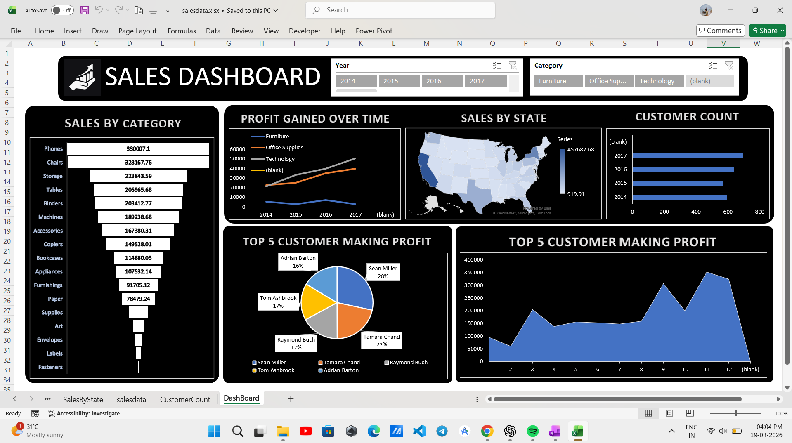

# 📊 Sales Dashboard (Excel Project)

## 🔹 Overview

This project presents an interactive **Sales Dashboard** built using **Microsoft Excel**. It provides a comprehensive analysis of sales performance, profit trends, customer insights, and regional distribution.

The dashboard is designed to help businesses make **data-driven decisions** by visualizing key metrics in a clear and interactive way.

---

## 🔹 Dashboard Features

### 📌 Sales by Category

* Displays total sales across product categories like Phones, Chairs, Storage, Tables, etc.
* Helps identify top-performing and low-performing product segments.

### 📈 Profit Gained Over Time

* Line chart showing yearly profit trends.
* Enables tracking of business growth and performance over time.

### 🗺️ Sales by State

* Map visualization representing sales distribution across different states.
* Highlights high-revenue regions.

### 👥 Customer Count

* Bar chart showing the number of customers by year.
* Useful for analyzing customer growth.

### 🏆 Top 5 Customers Making Profit

* Pie chart showing contribution of top customers to overall profit.
* Helps identify high-value customers.

### 📊 Monthly Profit Trend

* Area chart displaying profit variation across months.
* Useful for identifying seasonal trends.

### 🎛️ Interactive Filters (Slicers)

* Filter data dynamically using:

  * Year (2014–2017)
  * Category (Furniture, Office Supplies, Technology)

---

## 🔹 Tools & Technologies Used

* Microsoft Excel
* Pivot Tables
* Pivot Charts
* Slicers
* Map Chart Visualization

---

## 🔹 Key Insights

* 📌 Phones and Chairs are the highest revenue-generating categories
* 📈 Profit shows a steady increase over the years
* 🗺️ Certain states contribute significantly higher sales
* 👥 Customer count has grown consistently
* 🏆 A small group of customers contributes a major portion of profit

---

## 🔹 File Included

* `salesdata.xlsx` – Contains dataset and fully interactive dashboard

---

## 🔹 Dashboard Preview

*(Add your screenshot here)*

---

## 🔹 Use Case

This project demonstrates:

* Data Analysis
* Data Visualization
* Business Intelligence
* Dashboard Creation

It is suitable for roles like:

* Data Analyst
* Business Analyst

---

## 🔹 Author

**Kunal Chandelkar**
🎓 B.Tech CSE (2025)
📍 Bhilai, Chhattisgarh

---

## ⭐ If you like this project

Give it a star ⭐ on GitHub!

